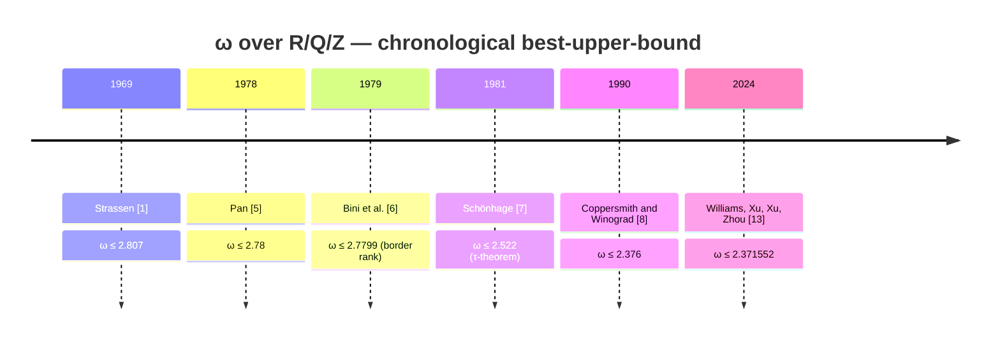
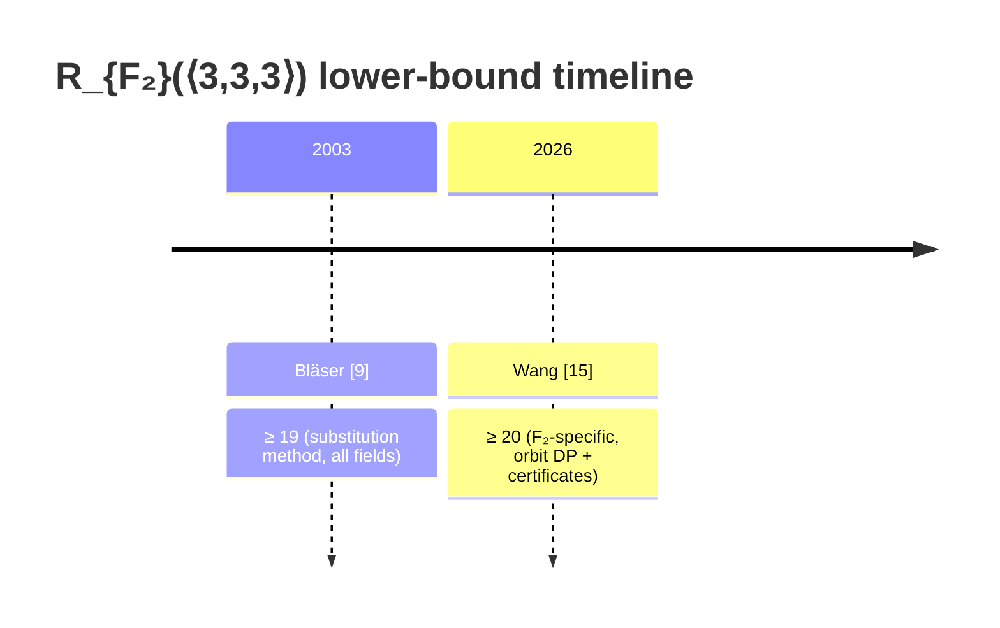

# Per-field history of matmul complexity

One section per field, with a chronological timeline of the best-known
matmul complexity result and the article that proved it. References use
the numbered system in [REFERENCES.md](../../REFERENCES.md) — every entry links
to its `[N]` slot.

**Two flavours of "best-known" are tracked:**

1. **ω** — the *asymptotic* matmul exponent (smallest constant with `n×n`
   matmul possible in `O(n^ω)`). Most studied over `R`/`Q`.
2. **Small-format ranks** — exact rank of specific `⟨n,m,p⟩` tensors. The
   improvement story is largely concentrated on `⟨3,3,3⟩` and `⟨4,4,4⟩`.

Both depend on the field, and the dependence is **non-monotone**
(see [RANK_KNOWLEDGE.md](RANK_KNOWLEDGE.md) §1.2bis for the field-transfer
rules).

---

## 1. `R` / `Q` / `Z` — the "classical" case

These fields share the same matmul-rank landscape for practical purposes
(`R(T)` is the same over `R`, `Q`, `Z` for the matmul tensor).

### 1.1 ω timeline

Note: between [8] (1990) and [13] (2024) there were a sequence of refined
ω bounds via deeper CW-method analyses (Stothers 2010, Vassilevska
Williams 2012, Le Gall 2014, Alman–Vassilevska Williams 2020, Duan–Wu–
Zhou 2022). These intermediate references aren't yet entered in
[REFERENCES.md](../../REFERENCES.md) — placeholders for a future pass.

### 1.3 The "feasible" ω track (practical small-n)

The Williams 2024 bound `ω ≤ 2.371552` and its predecessors share a
catch: they hold only for **astronomically large** `n` (often
`n > 10^100`). For practical small base cases the picture is different —
Strassen recursion at `O(n^{2.807})` is still dominant up to `n_0 ≈ 28`,
and Pan 1982 was the long-time best for `n_0 ≥ 28` at `O(n^{2.773372})`.

[\[19\]](../../REFERENCES.md#19-schwartz-zwecher25) (Schwartz & Zwecher 2025)
improves that to `O(n^{2.773203})` — the **fastest matmul algorithm
with base case smaller than 1000**, dominant for many small `n_0`
starting at 28. Technique: trilinear aggregation + de Groote equivalence
+ sparse decomposition. This is a separate "feasible-ω" line from the
asymptotic ω race ([\[13\]](../../REFERENCES.md#13-williams2024)).

### 1.2 Small-format best-known ranks

| format | rank | year | source | ref |
|---|---|---|---|---|
| `⟨2,2,2⟩` | **7** | 1969 | Strassen | [\[1\]](../../REFERENCES.md#1-strassen69) — tight |
| `⟨2,2,3⟩` | **11** | 1971 | Hopcroft–Kerr | [\[2\]](../../REFERENCES.md#2-hk71) — tight |
| `⟨2,3,3⟩` | **15** | 1971 | Hopcroft–Kerr (et seq.) | [\[2\]](../../REFERENCES.md#2-hk71) — tight |
| `⟨3,3,3⟩` | **23** | 1976 | Laderman | [\[4\]](../../REFERENCES.md#4-lad76) — open `[19, 23]` |
| `⟨4,4,4⟩` | **49** | 1969 | Strassen² (recursive) | [\[1\]](../../REFERENCES.md#1-strassen69) — open |
| `⟨5,5,5⟩` | ~98 | various | Smirnov + improvements | [\[11\]](../../REFERENCES.md#11-smirnov) |

**Lower bounds**:

| format | LB | year | source |
|---|---|---|---|
| `⟨3,3,3⟩` | **≥ 19** | 2003 | Bläser, substitution method [\[9\]](../../REFERENCES.md#9-blaser03) |

---

## 2. `F₂` — GF(2), boolean / XOR arithmetic

`F₂` has the richest cancellation patterns (`a + a = 0`), so it can admit
strictly lower ranks for some formats. This is where AlphaTensor [\[12\]](../../REFERENCES.md#12-alphatensor)
made its largest improvements.

### 2.1 Small-format best-known ranks

| format | F₂ rank UB | year | source | ref |
|---|---|---|---|---|
| `⟨2,2,2⟩` | **7** | 1969 | Strassen reduces mod 2 | [\[1\]](../../REFERENCES.md#1-strassen69) — tight |
| `⟨3,3,3⟩` | **23** | 1976 | Laderman reduces mod 2 | [\[4\]](../../REFERENCES.md#4-lad76) — AlphaTensor did NOT improve |
| `⟨4,4,4⟩` | **47** | 2022 | AlphaTensor | [\[12\]](../../REFERENCES.md#12-alphatensor) ← **breaks 49** |
| `⟨4,5,5⟩` | **76** | 2022 | AlphaTensor | [\[12\]](../../REFERENCES.md#12-alphatensor) ← from 80 |
| `⟨5,5,5⟩` | **96** | 2022 | AlphaTensor | [\[12\]](../../REFERENCES.md#12-alphatensor) |

### 2.2 Lower bounds

### 2.3 Notes on ω over F₂

There's no widely-cited tight ω bound specific to F₂ in the same form as
over R. AlphaTensor's improvements imply ω_{F₂} ≤ something below the
classical 2.371552, but the asymptotic story over F₂ is not the primary
focus of the F₂ research. See [\[12\]](../../REFERENCES.md#12-alphatensor)
supplementary materials.

---

## 3. `C` — complex numbers

For complex matmul there's almost no separate history pre-2025: the same
`R(⟨n,m,p⟩)` bounds from `R`/`Q` apply (every R-algorithm is also a
C-algorithm), and `C` doesn't admit the cancellation tricks that make F₂
shorter. AlphaEvolve [\[14\]](../../REFERENCES.md#14-alphaevolve) is the first
result to find a C-specific improvement over `Strassen²`.

### 3.1 Small-format best-known ranks

| format | C rank UB | year | source | ref |
|---|---|---|---|---|
| `⟨2,2,2⟩` | **7** | 1969 | Strassen | [\[1\]](../../REFERENCES.md#1-strassen69) |
| `⟨3,3,3⟩` | **23** | 1976 | Laderman | [\[4\]](../../REFERENCES.md#4-lad76) |
| `⟨4,4,4⟩` | **48** | 2025 | AlphaEvolve | [\[14\]](../../REFERENCES.md#14-alphaevolve) ← **breaks 49**, complex-specific |
| `⟨3,4,7⟩` | **63** | 2025 | AlphaEvolve (over 0.5·C) | [\[14\]](../../REFERENCES.md#14-alphaevolve) |

### 3.2 The non-monotone landscape for `⟨4,4,4⟩`

The most striking demonstration that field-choice matters:

| field | best ⟨4,4,4⟩ rank | year | source |
|---|---|---|---|
| `F₂` | **47** | 2022 | [\[12\]](../../REFERENCES.md#12-alphatensor) |
| `C` | **48** | 2025 | [\[14\]](../../REFERENCES.md#14-alphaevolve) |
| `R / Q / Z` | **49** | 1969 | [\[1\]](../../REFERENCES.md#1-strassen69) (Strassen²) |

These are non-monotone: F₂ beats C beats R, even though C is the "richer"
field. The reason is that F₂ allows cancellations no characteristic-0
field permits (`a + a = 0`). Algorithms do not transfer freely between
fields — see [RANK_KNOWLEDGE.md](RANK_KNOWLEDGE.md) §1.2bis.

---

## 4. Commutative bilinear (theoretical baseline)

This is **not** a practical setting — algorithms that assume `a·b = b·a`
don't recurse onto matrix entries. Listed for completeness; ranks here
can be lower than the non-commutative version, but that doesn't translate
to faster matmul.

### 4.1 Small-format known commutative ranks

| format | `R_c` | year | source | ref |
|---|---|---|---|---|
| `⟨2,2,2⟩` | **7** | 1969/1971 | Strassen; lower bound by Winograd | [\[1\]](../../REFERENCES.md#1-strassen69), [\[3\]](../../REFERENCES.md#3-winograd71) |
| `⟨3,3,3⟩` | open; UB ≈ 17–21 | various | see [\[10\]](../../REFERENCES.md#10-drisc09) | — |

---

## 5. Open and out-of-scope

- `F₃`, `F₅`, `F₇`, … prime fields other than `F₂`: each has its own
  lower-bound story; almost nothing published outside `F₂` and char-0.
  Wang [\[15\]](../../REFERENCES.md#15-wang26) explicitly notes "various small
  matrix formats" — likely candidates for follow-up.
- `Q[i]` / `Z[i]` (Gaussian rationals/integers): the natural field for
  AlphaEvolve's `0.5·C` algorithms. Whether AlphaEvolve's ⟨4,4,4⟩=48
  represents a strict improvement over `Q[i]` (not just `C`) seems
  plausible but isn't separately catalogued.
- Border rank `R̃` per field: tracked in
  [RANK_KNOWLEDGE.md](RANK_KNOWLEDGE.md) §1 (the third column of the
  main table) but doesn't have its own timeline doc yet.

---

## Working notes

- Several intermediate ω-timeline entries between [\[8\]](../../REFERENCES.md#8-cw90)
  (1990, ω ≤ 2.376) and [\[13\]](../../REFERENCES.md#13-williams2024) (2024,
  ω ≤ 2.371552) aren't yet in [REFERENCES.md](../../REFERENCES.md). They're
  the Stothers/Vassilevska-Williams/Le-Gall/Alman line plus
  Duan–Wu–Zhou 2022. Worth a one-shot import pass.
- AlphaTensor's ω contribution (if any new bound was implied) should
  cross-check with [\[13\]](../../REFERENCES.md#13-williams2024).
- For F₂ ω: not well-tracked in this doc yet — needs a sub-section
  once we have authoritative numbers.
